    

研究报告

                

**************************

目录

<!-- TOC -->

- [研究报告简述](#研究报告简述)
- [研究内容简述](#研究内容简述)
- [一、应用底层————区块链网络架构](#一应用底层区块链网络架构)
    - [Fabric 1.0 总体架构简要介绍](#fabric-10-总体架构简要介绍)
    - [fabric 中的区块链账本](#fabric-中的区块链账本)
- [二、智能合约：](#二智能合约)
- [三、分布式一致性与共识服务和算法](#三分布式一致性与共识服务和算法)
    - [hyperledger Fabric 中的共识服务](#hyperledger-fabric-中的共识服务)
    - [一些其他的共识算法的简单介绍](#一些其他的共识算法的简单介绍)
    - [Reference](#reference)

<!-- /TOC -->

## 研究报告简述

研究报告主要分为两个部分，第一个部分简述项目开展以来，小组成员对区块链技术的研究，并在研究报告中结合实际项目对区块链技术的应用。第二个部分主要对区块链技术的实际应用场景、应用难题、技术展望进行了一定的思考和讨论。

文章中所涉及到和应用的内容在文末有列出。

## 研究内容简述
目前区块链技术在行业中的应用尚处在初级阶段，大面积的落地项目和实际应用场景相对其他成熟技术比较局限和狭小。现在比较出名的区块链项目包括但是不限于：
* 比特币/Bitcoin
* Hyperledger Fabric
* 以太坊/Ethereum
* EOS
* NEO

小组选择了当下热门的区块链应用场景————医疗健康平台建设，结合区块链技术，深入挖掘和研究了区块链技术的潜力。通过这个项目，我们小组在保证完整实现项目目标的同时，对区块链技术本身的问题和发展都得到了更加全面和客观的理解和认识。另外，我们在开发过程中总结了一些遇到的问题和在摸索中得到的解答，汇集了不少有效、新颖的观点。以上这些都会是这个研究报告的主体内容。

## 一、应用底层————区块链网络架构

### Fabric 1.0 总体架构简要介绍

早在 2016 年 IBM 其实就已经推出了他们的联盟链实现 Hyperledger Fabric 0.6(以下简称 Fabric 0.6) ，当时的这个版本在应用过程中实际上还存在许多问题，这也导致了这个 Fabric 版本并没有真正的被大规模应用到行业中。

图 1.1 展示了 Fabric 0.6 版本的总体架构：
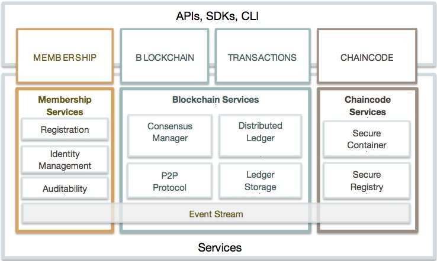

图 1.2 展示了 Fabric 0.6 版本的运行时架构：

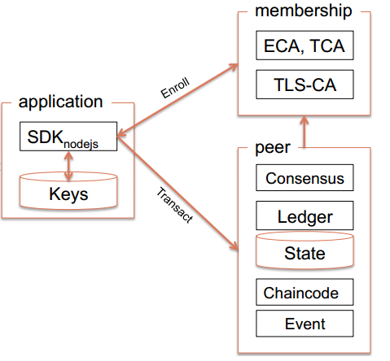

0.6版本的架构特点是：

* 结构简单： 应用-成员管理- Peer 的三角形关系，主要业务功能全部集中于 Peer 节点；
* 架构问题：由于 peer 节点承担了太多的功能，所以带来扩展性、可维护性、安全性、业务隔离等方面的诸多问题，所以0.6版本在推出后，并没有大规模被行业使用，只是在一些零星的案例中进行业务验证；

针对上述问题，1.0版本做了很大的改进和重构：

图 1.3 展示了最新的 Fabric 1.0 运行时架构：
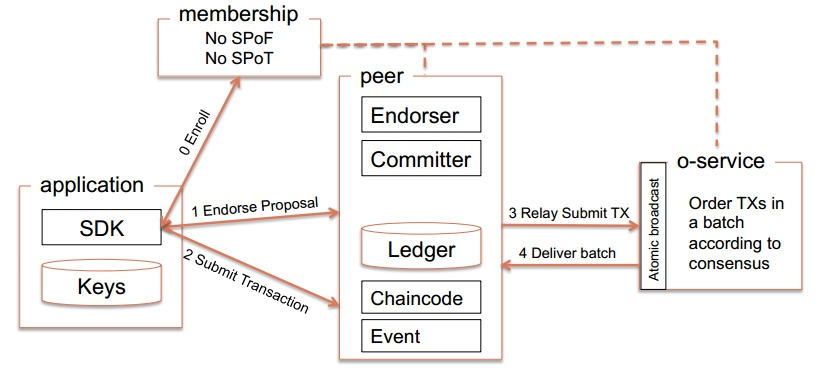

Fabric 1.0 架构要点：

* 分拆 Peer 的功能，将 Blockchain 的数据维护和共识服务进行分离，共识服务从 Peer 节点中完全分离出来，独立为 Orderer 节点提供共识服务；
* 基于新的架构，实现多通道（channel）的结构，实现了更为灵活的业务适应性（业务隔离、安全性等方面）
支持更强的配置功能和策略管理功能，进一步增强系统的灵活性和适应性；

* 最新的 1.0 版本中，上图中的 Membership 服务已经改名为 fabric-ca

从 Fabric 的新架构设计的建议文档看，1.0 版本的设计目标如下：

1. chaincode 信任的灵活性：支持多个 ordering 服务节点，增强共识的容错能力和对抗 orderer 作恶的能力
2. 扩展性： 将 endorsement 和 ordering 进行分离，实现多通道（实际是分区）结构，增强系统的扩展性；同时也将 chaincode 执行、ledger、state 维护等非常消耗系统性能的任务与共识任务分离，保证了关键任务（ordering）的可靠执行
3. 保密性：新架构对于 chaincode 在数据更新、状态维护等方面提供了新的保密性要求，提高系统的业务、安全方面的能力
4. 共识服务的模块化：支持可插拔的共识结构，支持多种共识服务的接入和服务实现
架构特点

Hyperledger fabirc 1.0 版本的在 0.6 版本基础上，针对安全、保密、部署、维护、实际业务场景需求等方面进行了很多改进，特别是 Peer 节点的功能分离，给系统架构具备了支持多通道、可插拔的共识的能力。

Fabric 1.0版本的关键架构：

多链与多通道
Fabric 1.0 的重要特征是支持多 chain 和多 channel；

所谓的 chain（链）实际上是包含 Peer 节点、账本、ordering 通道的逻辑结构，它将参与者与数据（包含 chaincode 在）进行隔离，满足了不同业务场景下的”不同的人访问不同数据“的基本要求。

同时，一个 peer 节点也可以参与到多个 chain 中（通过接入多个 channel）；如下图所示
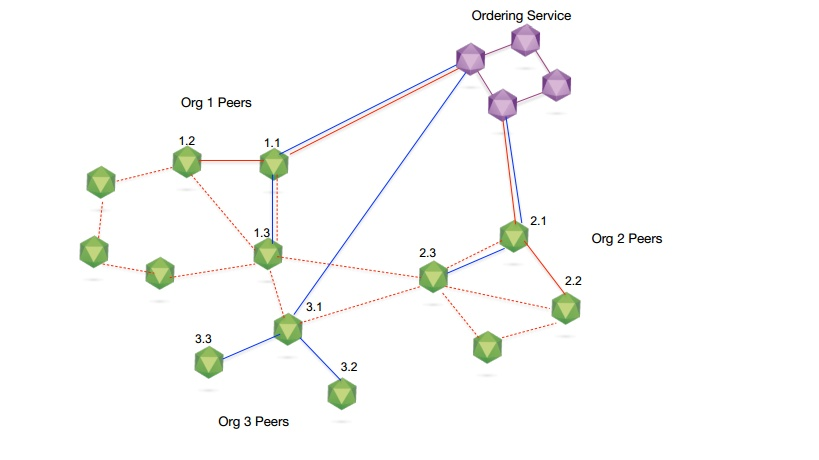

关于通道：通道是有共识服务（ordering）提供的一种通讯机制，类似于消息系统中的发布-订阅（PUB/SUB)中的 topic；基于这种发布-订阅关系，将 peer 和 orderer 连接在一起，形成一个个具有保密性的通讯链路（虚拟），实现了业务隔离的要求；通道也与账本（ledger）-状态（worldstate）紧密相关；如下图所示：

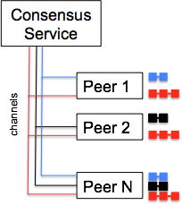

共识服务与（P1、PN）、（P1、P2、P3）、（P2、P3）组成了三个相互独立的通道，加入到不同通道的 Peer 节点能够维护各个通道对应的账本和状态；也其实也对应现实世界中，不同业务场景下的参与方，例如银行、保险公司；物流企业、生产企业等实体结构；我们可以看到 channel 机制实际上是的 Fabric 建模实际业务流程的能力大大增强了，大家可以发挥想象力去找到可能的应用领域

交易（数据）流程说明
新版本的架构变化导致新的交易流程的变化，我们简述如下：

总体流程如下图所示：

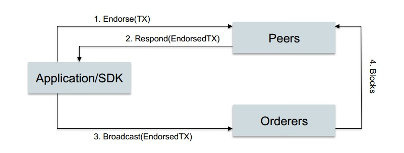

1. 应用程序通过 SDK 发送请求道 Peer 节点（一个或多个）
2. peer 节点分别执行交易（通过 chaincode），但是并不将执行结果提交到本地的账本中（可以认为是模拟执行，交易处于挂起状态），参与背书的 peer 将执行结果返回给应用程序（其中包括自身对背书结果的签名）
3. 应用程序 收集背书结果并将结果提交给 Ordering 服务节点
4. Ordering 服务节点执行共识过程并生成 block，通过消息通道发布给 Peer 节点，由 peer 节点各自验证交易并提交到本地的 ledger 中（包括 state 状态的变化）
上述过程对应的执行序列图如下：

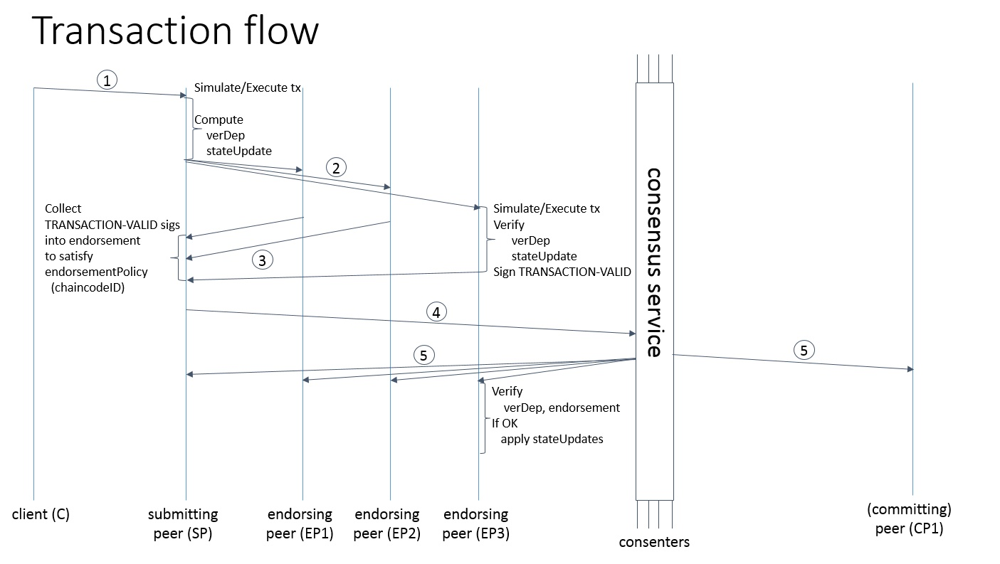

### fabric 中的区块链账本

要了解 Fabric 对事务的处理，首先我们需要了解 Fabric 中的账本，也就是实际存储和查询数据的地方。

图 1.4 为 IBM 微讲堂中对 Fabric 1.0 账本的示意图：

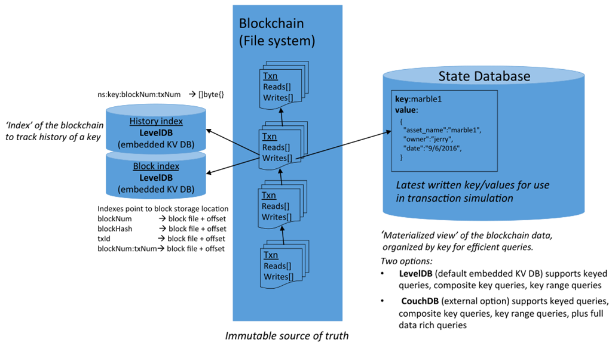

Fabric 1.0中的账本分为 3 种：

1. 区块链数据，这是用文件系统存储在 Committer 节点上的。区块链中存储了 Transaction 的读写集。
2. 为了检索区块链的方便，所以用 Level DB 对其中的 Transaction 进行了索引。
3. ChainCode 操作的实际数据存储在 State Database 中，这是一个 Key Value 的数据库，Fabric 0.6 默认采用的 Level DB，1.0 也支持使用 Couch DB 作为 State Database。

三、事务提交过程
了解了Fabric中的账本，接下来我们来了解一下对这些账本的操作涉及到的Transaction。

详细可见 fabric 1.0 安装配置与测试一文（中期研究报告）。

当执行 a 向 b 转账 10 元，在 cli 中执行的命令为：

    peer chaincode invoke -o orderer.example.com:7050  --tls $CORE_PEER_TLS_ENABLED --cafile /opt/gopath/src/github.com/hyperledger/fabric/peer/crypto/ordererOrganizations/example.com/orderers/orderer.example.com/msp/cacerts/ca.example.com-cert.pem  -C mychannel -n devincc -c '{"Args":["invoke","a","b","10"]}'

当 cli 中运行该命令时，相关的事务生命周期和相关账本的示例图如下：

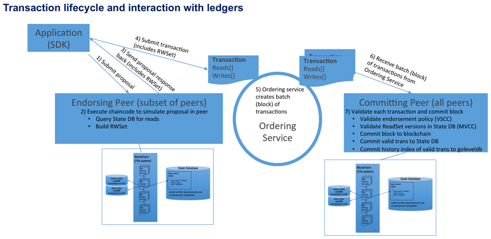

## 二、智能合约：

智能合约（Smart Contract）是区块链中应用到的，时下非常热门的概念。它最重要的特性是使得交易能够在没有第三方的情况下进行，而这种交易本身是可信的。另外它还具有使交易是无法追踪、同时也是不可逆的特性。

智能合约的概念于 1995 年就已经被科学家 Nick Szabo 提出了，他将智能合约描述为一种以信息化方式传播、验证或者执行合约的计算机协议。

下面是一段引用于维基百科的描述。

> A smart contract is a computer protocol intended to digitally facilitate, verify, or enforce the negotiation or performance of a contract. Smart contracts allow the performance of credible transactions without third parties. These transactions are trackable and irreversible.

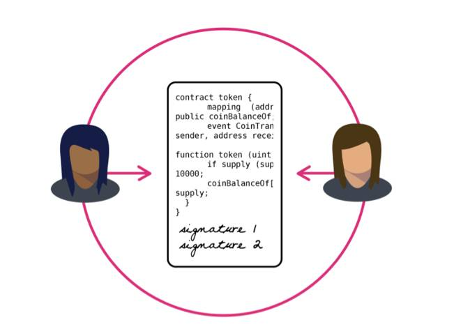

率先应用了诸如智能合约、分布式一致性等特性在数字货币中，并成为区块链鼻祖的比特币 (Bitcoin) 虽然通过 POW (proof of work) 实现了分布式一致性，同时使用 UTXO 模型 存储和管理底层数据结构，实现了去中心化的分布式账本，并且在一定程度上实现了『可编程』这一特点，但是它的脚本机制非常简单，只是一个基于堆栈式的脚本语言，它不仅没有函数的功能，同时也不是图灵完备的，无法实现复杂的逻辑。

## 三、分布式一致性与共识服务和算法
从比特币为首的密码货币大火以来，新的区块链应用和基础设施等等层出不穷，区块链作为新兴的热门技术也已经被无数人所知晓和研究。但是仅仅局限于完成一两个应用并不是我们完成这个项目的终极目的，这些区块链应用的底层技术，也就是作为一个分布式网络他们又是如何工作的，是整个区块链应用的核心，也是我们学习和研究的重点内容。

无论是 Bitcoin、Hyperledger Fabric 还是 Ethereum，作为一个分布式网络，首先需要解决分布式一致性的问题。在网络中所有的节点需要对同一个提案或者值达成共识。

节点间建立共识这一问题在一个所有节点都是可以被完全信任的分布式集群中已经是一个比较难以解决的问题，更不用说在复杂的区块链网络中了。区块链网络中并没有强制要求每个节点都是可信任的节点，因此问题的复杂程度对比普通的分布式网络来说是上升了一个层次的。

对于共识算法，我们主要研究了 Hyperledger Fabric 中应用到的和一些目前已经提出的算法。

### hyperledger Fabric 中的共识服务

作为现在比较流行的区块链基础设施之一：Fabric 中当然也应用到了共识机制。

我们使用的项目使用的 fabric 版本为 1.0 版本，目前 fabric 提供的共识服务有三种：solo，kafka和 PBFT。

fabric 中对于共识服务的实现并非简单基于一个或者多个共识算法，而是更加深入和完整地考虑到分布式系统中消息的投递以及事务处理的问题，并以此保证网络中业务的一致性。因此完整地研究 fabric 的共识服务实现是有益且有必要的。

接下来介绍 fabric 如何实现完整的共识服务。

首先， fabric 中建立共识的过程由以下两个独立的过程构成：

* Ordering of transactions (交易排序)
* Validating Transactions（交易验证）

fabric 从设计逻辑上将这个两个过程分离开来，保证了 fabric 可以采用任何的共识模块。另一个角度来说，我们可以在 fabric 上使用自己开发的共识算法（当然我们没有深入到这一个步骤），从这个角度来说，fabric 采取的模块化设计，无疑是使得我们在应用落地上的灵活性、安全性以及可定制性得到了加强！

1.0 版本中 fabric 的通信也是一大亮点，同时也是共识服务的关键点所在。fabric 的通信主要有三种节点：
1. Orderer 作为 fabric 共识服务的网络节点；
2. Peer 节点，作为组成 fabric 网络的主要节点；
3. client 端，作为用户使用的端口，负责直接与 fabric 网络通信。

最后 fabric 的主要模块提供了共识服务的完整架构。如图显示了几个重要的设计模块（没有全部涉及到）：
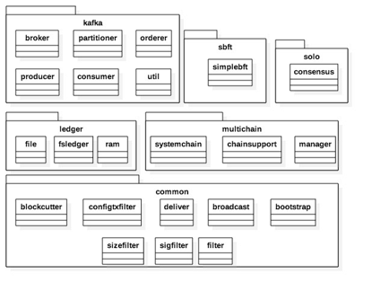

模块说明：

一、Kafka 模块（Orderer以Kafka方式对外提供共识服务）
1. Broker：Kafka的Broker信息
2. Partitioner：kafka的基础连接信息，包括topic、partition
3. Consumer、Producer：分别为kafka的消费、生产者接口
4. Orderer：消息的排序与数据块管理接口

二、Multichain

封装了Chain操作相关接口。Chain目前有四种实现方式：SystemChain 以及其它Chain（Kafaka、Solo、Sbft）。其中 SystemChain 为必须，其他三个根据配置启用。

1. manager：主要负责 chain 的创建与访问控制。
2. chainsupport：主要负责 chain 的操作接口，包括新增签名，数据块写入等。
3. systemchain: 封装了systemchain 的相关操作，systemchain 主要用于管理配置以及安全相关控制。

三、ledger

orderer 对外服务过程中，允许 client 客户端(例如peer)批量获取消息， 所以orderer 需要维护历史消息拷贝。这些历史消息维护在 Orderer 的 Ledger 模块中。

1. File：实现了以 json 格式为存储方式的的文件系统账本。该账本实现方式支持容灾，但性能不高，
2. Ram : Ram 实现了一个简单的基于内存存储的账本，可以自由调整数据存储相关参数，例如历史存储大小等。该账本不支持容灾，每次系统挂掉，内存数据将会消失，重启后，将会重新建立新的账本。

四、common：提供了一些公共的接口，包括配置信息、消息的分组与组装、消息过滤规则等。

在一个 fabric 网络中，建立共识的第一步是从 client 客户端接收交易。这里 Orderer 主要提供两个Grpc接口：Broadcast 和 Deliver，两个接口面向客户端（fabric 网络中的 peer）通信。peer 节点通过 Broadcast 向 orderer 发送消息，orderer 通过 Broadcast 获取客户端的消息并将其储存。peer 节点通过 Deliver接口从Order获取数据。

紧接着 orderer 接收到交易之后，由 Ordering Service 进行交易排序。这里Ordering Service 可以用多种方法实现，在开发测试阶段可以用中心化的排序服务，也可以面向不同的网络采用分布式协议。

为了实现交易的私密，ordering service 即排序模块被设计成不能看到交易的具体内容（对交易内容不可见），交易的内容加密方式则可以采用加密或者是哈希处理。

交易通过接口被传递到排序服务，然后排序服务根据共识算法和配置策略将交易排序。为了提高效率，排序服务会将多个交易打包成一个块再输出，打包方式可以选择按时间间隔打包或者按照数目打包，排序服务的最关键职责需要保证块内交易的时间顺序不会出现分叉。

为了校验交易的正确性，共识的建立依赖于智能合约层，智能合约层定义了一些逻辑来确认如何验证交易有效。智能合约层根据特定的策略与约定来确认每一笔交易都是有效的。无效的交易会被拒绝，并在块中剔除。

潜在的校验失败主要分为以下两种：语法错误、逻辑错误。

语法错误包含以下几种类型，比如无效输入、未验证的签名、重复的交易等，这类交易应该被丢弃。

第二类错误比较复杂，需要有特定策略来觉得如何处理。比如，一笔交易经验证是多重支付。我们需要记录这类交易已验证是否是策略所需要的。

共识层通过通讯层来实现与 peer 或者是其他节点的消息互通。

### 一些其他的共识算法的简单介绍

无论是在哪一个分布式系统中，分布式系统的一致性问题都是必须解决的问题。具体地讲，这个问题可以描述为：如何保证一个集群中，所有节点中的数据完全相同并且能够对某个提案（Proposal）达成一致。

只有一致性这个问题得到解决之后，分布式系统才能够正常工作。而区块链中所应用的共识算法，就是这样一个用来保证分布式系统一致性的方法。

POW：Proof of Work，工作证明。
比特币在Block的生成过程中使用了POW机制，一个符合要求的Block Hash由N个前导零构成，零的个数取决于网络的难度值。要得到合理的Block Hash需要经过大量尝试计算，计算时间取决于机器的哈希运算速度。当某个节点提供出一个合理的Block Hash值，说明该节点确实经过了大量的尝试计算，当然，并不能得出计算次数的绝对值，因为寻找合理hash是一个概率事件。当节点拥有占全网n%的算力时，该节点即有n/100的概率找到Block Hash。

POS：Proof of Stake，股权证明。
POS：也称股权证明，类似于财产储存在银行，这种模式会根据你持有数字货币的量和时间，分配给你相应的利息。 
简单来说，就是一个根据你持有货币的量和时间，给你发利息的一个制度，在股权证明POS模式下，有一个名词叫币龄，每个币每天产生1币龄，比如你持有100个币，总共持有了30天，那么，此时你的币龄就为3000，这个时候，如果你发现了一个POS区块，你的币龄就会被清空为0。你每被清空365币龄，你将会从区块中获得0.05个币的利息(假定利息可理解为年利率5%)，那么在这个案例中，利息 = 3000 * 5% / 365 = 0.41个币，这下就很有意思了，持币有利息。

DPOS：Delegated Proof of Stake，委任权益证明。
比特股的DPoS机制，中文名叫做股份授权证明机制（又称受托人机制），它的原理是让每一个持有比特股的人进行投票，由此产生101位代表 , 我们可以将其理解为101个超级节点或者矿池，而这101个超级节点彼此的权利是完全相等的。从某种角度来看，DPOS有点像是议会制度或人民代表大会制度。如果代表不能履行他们的职责（当轮到他们时，没能生成区块），他们会被除名，网络会选出新的超级节点来取代他们。DPOS的出现最主要还是因为矿机的产生，大量的算力在不了解也不关心比特币的人身上，类似演唱会的黄牛，大量囤票而丝毫不关心演唱会的内容。

PBFT：Practical Byzantine Fault Tolerance，实用拜占庭容错算法。见前文拜占庭容错算法介绍。
PBFT是一种状态机副本复制算法，即服务作为状态机进行建模，状态机在分布式系统的不同节点进行副本复制。每个状态机的副本都保存了服务的状态，同时也实现了服务的操作。将所有的副本组成的集合使用大写字母R表示，使用0到|R|-1的整数表示每一个副本。为了描述方便，假设|R|=3f+1，这里f是有可能失效的副本的最大个数。尽管可以存在多于3f+1个副本，但是额外的副本除了降低性能之外不能提高可靠性。

以上主要是目前主流的共识算法。 
从时间上来看，这个顺序也是按该共识算法从诞生到热门的顺序来定。 
对于POW，直接让比特币成为了现实，并投入使用。而POS的存在主要是从经济学上的考虑和创新。而最终由于专业矿工和矿机的存在，让社区对这个标榜去中心化的算法有了实质性的中心化担忧，即传闻60％～70%的算力集中在中国。因此后来又出现DPOS，这种不需要消耗太多额外的算力来进行矿池产出物的分配权益方式。但要说能起到替代作用，DPOS来单独替代POW，POS或者POW＋POS也不太可能，毕竟存在即合理。每种算法都在特定的时间段中有各自的考虑和意义，无论是技术上，还是业务上。

如果跳出技术者的角度，更多结合政治与经济的思考方式在里面，或许还会跳出更多的共识算法，如结合类似PPP概念的共识方式，不仅能达到对恶意者的惩罚性质，还能达到最高效节约算力的目的也说不定。

至于说算法的选择，这里引用季总的这一段话作为结束：

一言以蔽之，共识最好的设计是模块化,例如Notary，共识算法的选择与应用场景高度相关，可信环境使用paxos 或者raft，带许可的联盟可使用pbft ，非许可链可以是pow，pos，ripple共识等，根据对手方信任度分级，自由选择共识机制，这样才是真的最优。

### Reference
[Hyperledger](https://www.hyperledger.org/)
[Github/hyperledger/fabric](https://github.com/hyperledger/fabric)
[Blockchain区块链架构设计之四：Fabric多通道和下一代账本设计](https://zhuanlan.zhihu.com/p/24605987)
[Consensus (computer science)————维基百科](https://en.wikipedia.org/wiki/Consensus_(computer_science))
[共识算法（POW,POS,DPOS,PBFT）介绍和心得————csdn](https://blog.csdn.net/lsttoy/article/details/61624287)
[区块链技术指南————gitbook](https://yeasy.gitbooks.io/blockchain_guide/content/)
[Hyperledger fabric 代码解析 之 Orderer Service](https://zhuanlan.zhihu.com/p/25358777)

